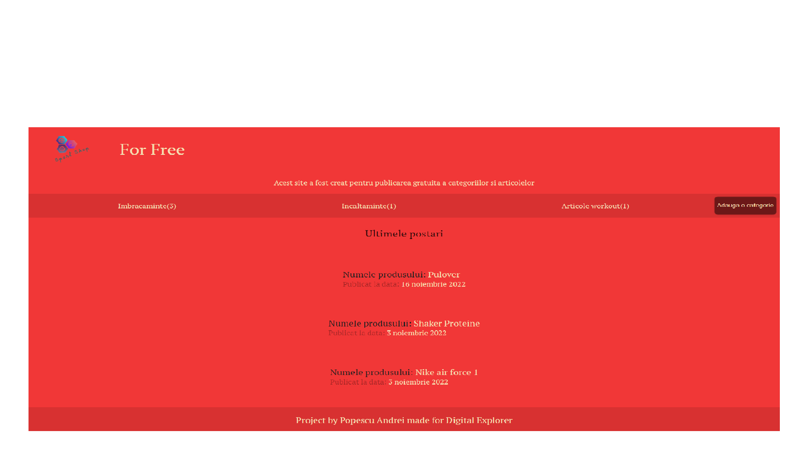
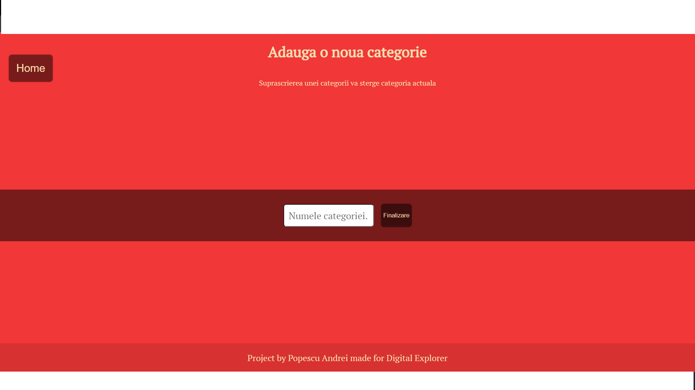
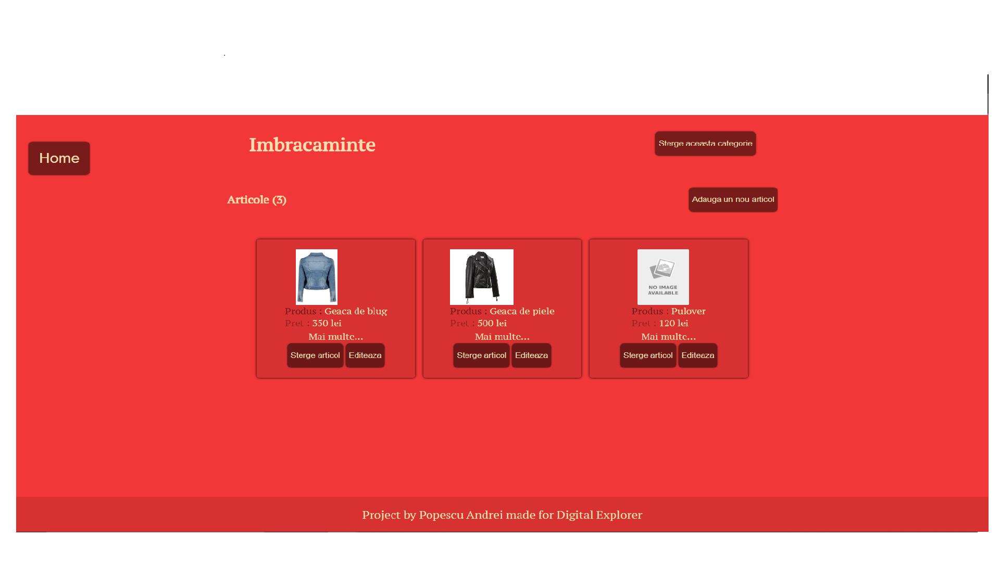
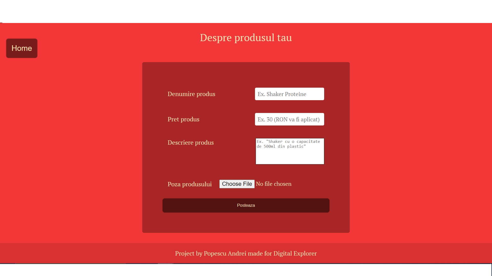
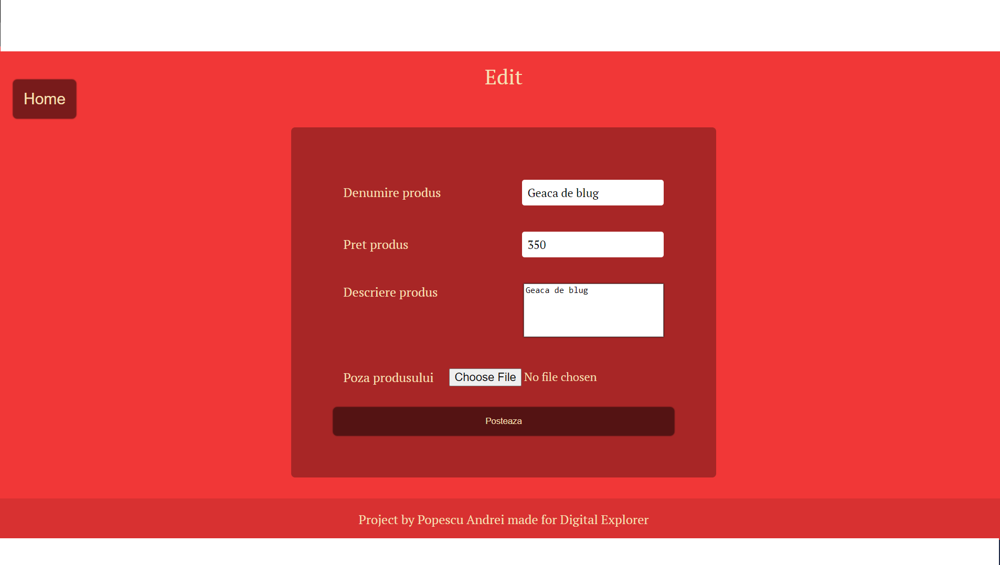
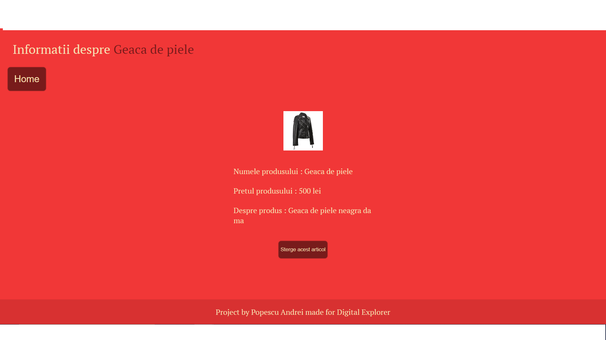

# Simple Website 
### For this project I used
```diff
! Javascript
- Express
+ EJS
# Multer for uploading images
+ MongoDB & Mongoose
@@ CSS @@
```

# This is how it works

### First page
* You can add a new category.
* The last three posts appear on the first page.



### Add a new category
#### If the chosen name is the same as an already existing one, it will overwrite it. 




### Category page
* Delete category.
* Actual posts.
* Edit and delete products.




### Publish a product
* If no picture is entered, one will be generated as "NO IMAGE AVABILE"


### Edit a product



### Product page




